# AI 网络与大模型工具完全入门指南

> **版本**：2026-08
> **定位**：面向非专业人士的网络、AI API、中转站与 Codex 入门与安装指南
> **适用人群**：学生、普通办公用户、AI 工具初学者、希望理解 AI 编程工具工作原理的用户
>
> **合规提示**：请遵守您所在国家/地区的法律法规。本文仅用于技术概念科普与合法工具的使用说明，不提供、也不鼓励任何规避网络监管的方法或工具。
>
> **阅读目标**：看完本文后，你应该能够回答以下问题：
>
> - 为什么有些国外 AI 服务可能无法直接访问？
> - 网络、DNS、IP、代理、VPN 分别是什么？
> - API 和网页端有什么区别？
> - API Key 是什么？
> - 什么是 API 中转站？
> - 为什么有些中转站可以直连，而有些不能？
> - Codex 是什么？它和 ChatGPT、VS Code、Git、Node.js 分别是什么关系？
> - 本地安装 Codex CLI 为什么经常涉及 Node.js、npm、Git 和 PATH？
> - 如何判断问题到底出在安装、认证、网络、API 还是模型兼容性？

---

## 目录

1. [一、先建立整体认知](#一先建立整体认知)
2. [二、网络环境与访问差异](#二网络环境与访问差异)
3. [三、DNS、域名、IP、HTTPS](#三dns域名iphttps)
4. [四、代理与 VPN 的概念说明](#四代理与-vpn-的概念说明)
5. [五、AI 模型、网页端与 API](#五ai-模型网页端与-api)
6. [六、什么是 API Key](#六什么是-api-key)
7. [七、什么是 API 中转站](#七什么是-api-中转站)
8. [八、中转站能否直连](#八中转站能否直连)
9. [九、Codex 是什么](#九codex-是什么)
10. [十、Codex、ChatGPT、API、VS Code、Git 的关系](#十codexchatgptapivs-codegit-的关系)
11. [十一、Codex 本地安装环境](#十一codex-本地安装环境)
12. [十二、Node.js 与 npm](#十二nodejs-与-npm)
13. [十三、Git 与 PATH](#十三git-与-path)
14. [十四、Windows 安装 Codex CLI](#十四windows-安装-codex-cli)
15. [十五、macOS 与 Linux](#十五macos-与-linux)
16. [十六、Codex Desktop 与 CLI](#十六codex-desktop-与-cli)
17. [十七、Codex 登录、API Key 与认证](#十七codex-登录api-key-与认证)
18. [十八、Codex 与 API 中转](#十八codex-与-api-中转)
19. [十九、VS Code 与 Codex](#十九vs-code-与-codex)
20. [二十、第一次使用 Codex 的正确流程](#二十第一次使用-codex-的正确流程)
21. [二十一、Codex 权限与安全](#二十一codex-权限与安全)
22. [二十二、API Key 安全](#二十二api-key-安全)
23. [二十三、常见错误与排查](#二十三常见错误与排查)
24. [二十四、推荐的学习路线](#二十四推荐的学习路线)
25. [二十五、一张图理解完整体系](#二十五一张图理解完整体系)
26. [二十六、常见误区](#二十六常见误区)
27. [二十七、最终总结](#二十七最终总结)
28. [参考资料](#参考资料)
29. [附录：一页速查表](#附录一页速查表)
30. [附录：最简单的最终理解](#附录最简单的最终理解)

---

# 一、先建立整体认知

如果完全不了解网络和 AI 工具，可以先不要记命令。

先记住：

> **网络访问问题、API 调用问题、AI 编程问题，是三个不同层次的问题。**

可以把整个体系拆成三层。

## 1. 网络层

解决：

> 我的电脑能不能访问目标服务？

包括：

- 网络环境
- DNS
- IP
- 代理
- VPN
- 路由

## 2. AI 服务层

解决：

> 我的程序能不能调用大模型？

包括：

- OpenAI 等模型服务
- API
- API Key
- Endpoint / Base URL
- 模型
- API 中转

## 3. AI 编程工具层

解决：

> AI 能不能帮我实际开发项目？

包括：

- Codex
- VS Code
- Git
- Node.js
- npm
- CLI
- Agent

整体关系可以理解成：

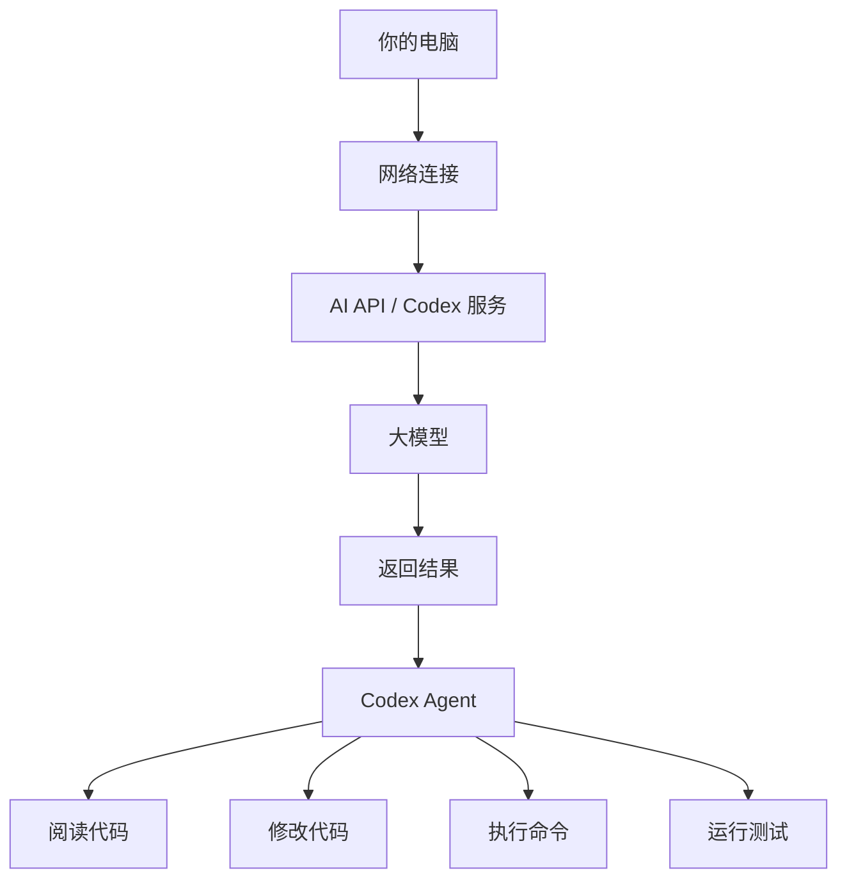

---

# 二、网络环境与访问差异

## 2.1 互联网并不是“全球无条件直连”

互联网是全球互联的网络，但不同国家和地区具有不同的：

- 网络基础设施
- 网络监管制度
- 数据治理要求
- 服务地区政策
- 网络安全策略

因此：

> 能访问互联网，不代表可以直接访问互联网上的所有服务。

例如某个 AI 服务可能同时存在：

1. 服务商自身的地区限制；
2. 网络路径问题；
3. DNS 解析问题；
4. IP 或域名访问问题；
5. 账户地区限制；
6. API 权限或计费限制。

所以：

> “打不开”不能直接等同于“网络被限制”。

具体到中国大陆的网络环境，部分境外互联网服务可能无法直接访问，这属于网络环境的客观差异。相关监管要求请以国家公布的法律法规为准。

> 请注意：**在中国大陆，使用未经批准的翻墙工具或服务访问境外网站，属于违反相关法律法规的行为。** 本文不介绍、不推荐任何此类工具或服务，也不提供任何规避网络监管的操作步骤。

## 2.2 常见的网络现象

用户遇到的现象可能包括：

- 网站无法打开；
- DNS 解析异常；
- 连接超时；
- 页面加载很慢；
- API 请求超时；
- 某些域名可以访问、另一些不能；
- 浏览器能访问，但某个命令行程序不能访问。

其中最后一种尤其重要：

> **不同软件不一定使用同一种网络代理配置。**

排查网络问题时，需要分别检查“具体软件”的网络路径，而不能只凭浏览器的表现下结论。

---

# 三、DNS、域名、IP、HTTPS

理解这些概念以后，很多“为什么打不开”的问题会容易很多。

## 3.1 域名

例如：

`example.com`

域名是方便人记忆的名称，可以类比成“公司名称”。

## 3.2 IP 地址

服务器最终需要通过 IP 地址进行网络通信。

可以粗略理解为：

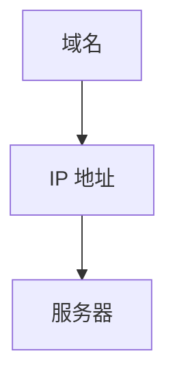

## 3.3 DNS

DNS 是 Domain Name System 的缩写，可以理解成互联网的“电话簿”。

程序访问 `example.com` 时，通常需要先查询“这个域名对应什么 IP”，然后建立连接。

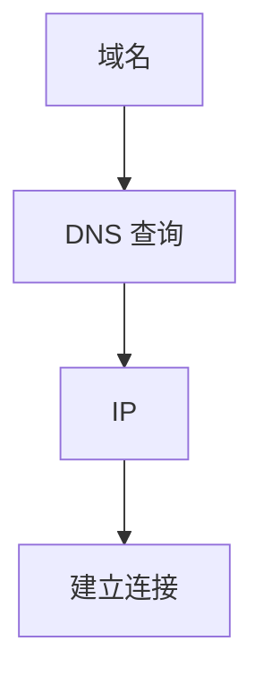

如果 DNS 查询本身出现问题，可能导致网站打不开——即使目标服务器实际上是正常的。

## 3.4 HTTPS

HTTPS 为网络通信提供加密。

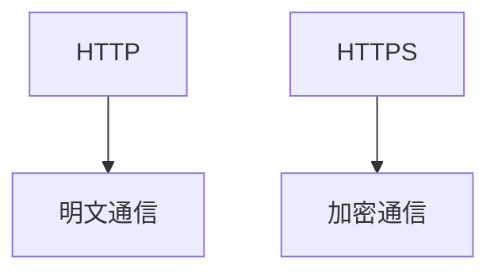

需要注意的是：

> HTTPS 保证了通信内容的加密，但并不意味着网络中所有元数据都不可观察。

因此“用了 HTTPS”与“网络完全不可检测”是两回事。

---

# 四、代理与 VPN 的概念说明

## 4.1 什么是代理

代理服务器的基本结构：

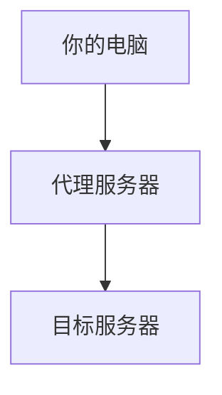

代理的核心作用是：**让网络请求经过另一个服务器转发。**

## 4.2 什么是 VPN

VPN（Virtual Private Network，虚拟专用网络）可以简单理解为：

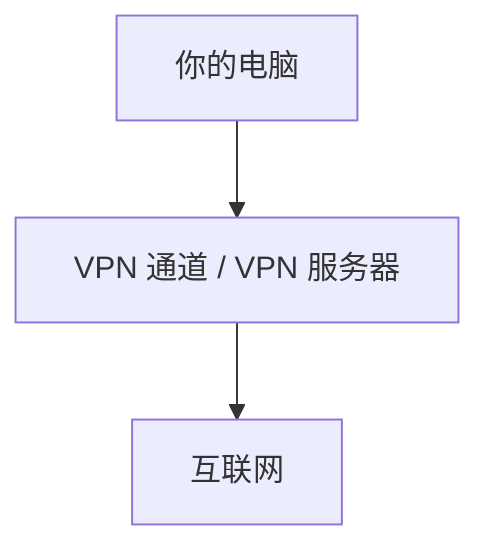

与普通应用层代理相比，VPN 通常可以覆盖更广泛的网络流量。

但是：

> **VPN、代理和具体客户端的行为取决于实现方式，不能只看名称判断所有流量都会经过代理。**

## 4.3 为什么“开了代理”不等于“所有程序都能访问”

不同的程序可能：

- 使用系统代理；
- 使用环境变量；
- 使用自己的代理设置；
- 完全不使用代理。

因此：

> **判断网络是否正常时，必须测试“具体软件的网络路径”，而不是笼统地说“我开了代理”。**

## 4.4 合规提醒

以上对代理与 VPN 的说明仅用于技术概念科普。

在中国大陆，**未经批准使用翻墙工具或服务访问境外网络属于违法违规行为**。请务必：

- 遵守国家法律法规；
- 不购买、不使用未经批准的翻墙工具或服务；
- 不参与传播此类工具或教程。

本文不会给出任何规避网络监管的软件推荐或操作步骤。

---

# 五、AI 模型、网页端与 API

## 5.1 普通用户使用 AI

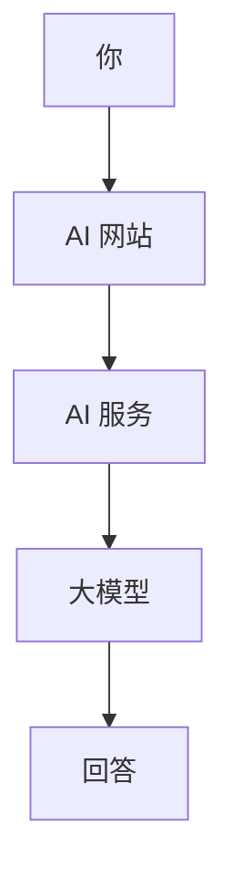

网页端已经帮你完成了很多事情：

- 登录；
- 身份验证；
- 请求格式；
- 模型选择；
- 上下文管理；
- 返回结果；
- UI 展示。

## 5.2 程序调用 AI

程序不需要打开网页，可以直接调用 API：

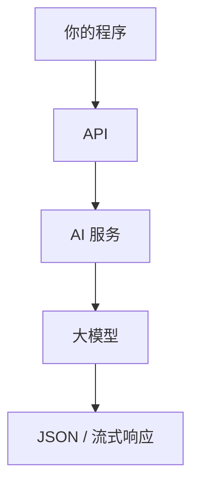

因此：

> **API 可以理解为“给程序使用的 AI 入口”。**

---

# 六、什么是 API Key

API Key 是一种 API 访问凭证。可以粗略类比：

> 网站登录用「账号 + 密码」，程序调用 API 则用「API Key」。

程序发送请求时可能携带：

- 请求；
- 认证信息；
- 模型；
- 输入内容。

服务器验证：

- Key 是否有效；
- 账户是否有权限；
- 额度是否足够；
- 模型是否允许使用。

然后返回结果。

## 6.1 API Key 不是普通密码

虽然两者都属于凭证，但 API Key 更接近：

> **程序访问服务的密钥。**

因此泄露 API Key 可能导致：

- 他人盗用额度；
- 产生额外费用；
- 账户风险；
- 服务被滥用。

---

# 七、什么是 API 中转站

## 7.1 官方 API

最直接的结构：

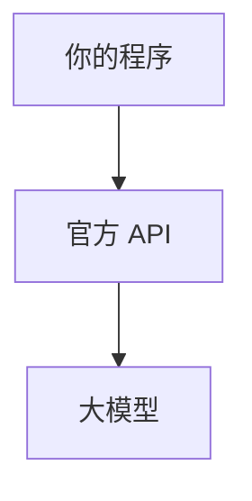

## 7.2 中转 API

增加第三方服务：

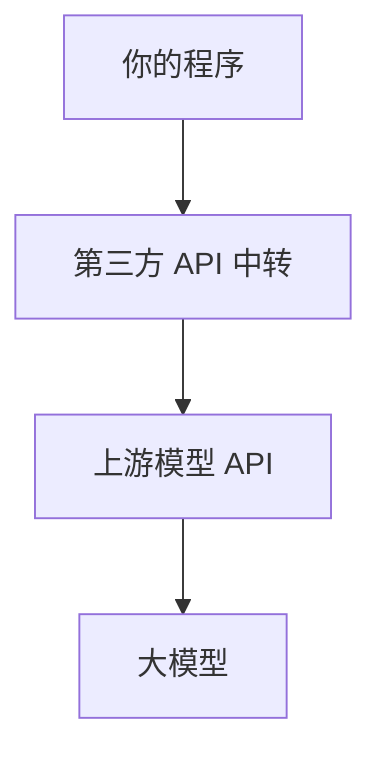

中转站可以理解为：

> **一个位于你的程序与上游 AI 服务之间的第三方 API 网关/转发层。**

## 7.3 中转站可能提供什么

不同服务商实现不同，常见功能可能包括：

- API 请求转发；
- 多模型统一入口；
- 账户计费；
- 额度管理；
- 日志统计；
- 请求路由；
- 模型名称映射；
- API 格式兼容。

但第三方中转服务的具体能力和可信度差异很大，**请选择合法合规、信誉良好的服务商，并注意数据安全**。

---

# 八、中转站能否直连

这是最容易被误解的问题。

## 8.1 正确答案

> **不一定。**

判断方法不是：

> “它是不是 OpenAI 中转？”

而是：

> **“我的电脑能不能直接访问这个中转站的 API Endpoint？”**

## 8.2 情况一：中转站可以直连

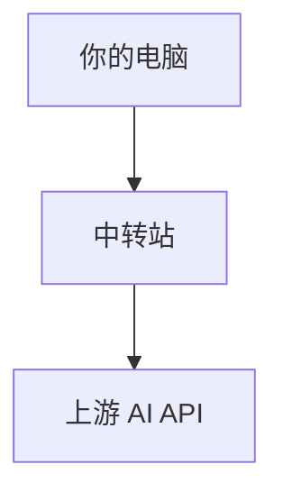

那么从用户电脑角度，**不需要额外的本地网络配置**，因为“你的电脑 → 中转站”已经可以正常建立连接，中转服务器再负责“中转站 → 上游 AI”。

## 8.3 情况二：中转站本身无法直连

如果“你的电脑 → 中转站”无法直接访问，那么通常就需要：

- 更换可访问的网络环境；
- 或者选择其他合规可用的服务。

请咨询服务商的支持文档，并在遵守当地法律法规的前提下选择服务。

## 8.4 最重要的判断公式

把整个链路拆开：

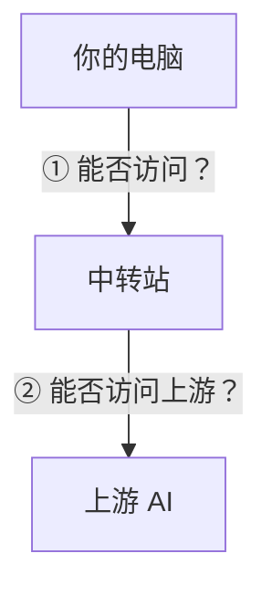

你真正需要判断的是：

- ① 用户 → 中转；
- ② 中转 → 上游。

而不是笼统地问：

> “用了中转还要不要 VPN？”

---

# 九、Codex 是什么

Codex 应该理解成：

> **面向软件开发任务的 AI coding agent。**

它与普通聊天机器人最大的区别之一，是它不仅可以回答“这段代码是什么意思？”，还可以围绕一个真实代码库执行：

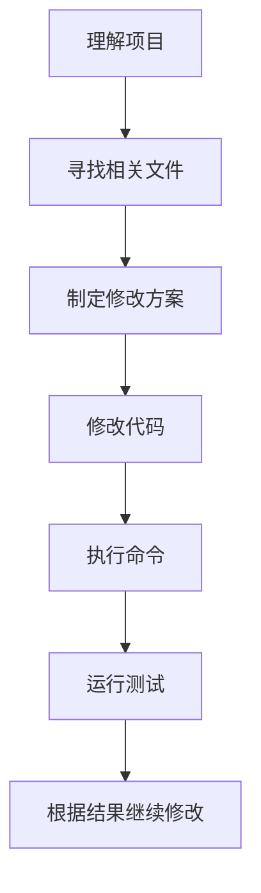

OpenAI 当前开发者文档将 Codex 定位为 coding agent，并提供围绕代码库、工程任务和自动化开发的使用场景。

## 9.1 Codex 不是“本地大模型”

这是一个非常重要的概念。

安装 Codex CLI 不等于安装 GPT 模型。通常结构是：

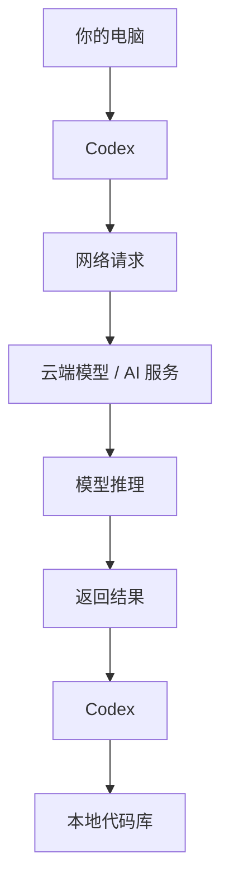

因此：

> **Codex 客户端可以运行在本地，但模型推理通常发生在云端。**

---

# 十、Codex、ChatGPT、API、VS Code、Git 的关系

可以用一个表理解。

| 名称 | 本质 | 主要作用 |
|---|---|---|
| ChatGPT | AI 产品/应用 | 人与 AI 对话 |
| OpenAI API | API 服务 | 程序调用模型 |
| Codex | AI coding agent | AI 协助完成软件开发任务 |
| VS Code | 代码编辑器/开发环境 | 编辑、运行和管理项目 |
| Git | 版本控制系统 | 记录和管理代码变更 |
| Node.js | JavaScript 运行环境 | 运行 Node 程序和 CLI |
| npm | Node 包管理器 | 安装、更新 Node 软件包 |

---

# 十一、Codex 本地安装环境

需要特别注意：

> **不同 Codex 使用方式的本地依赖并不完全相同。**

例如：

- Codex CLI；
- Codex Desktop；
- IDE 集成。

可能使用不同的安装方式。

## 11.1 Codex CLI 的典型环境

如果采用 npm 安装路线，可以理解为：

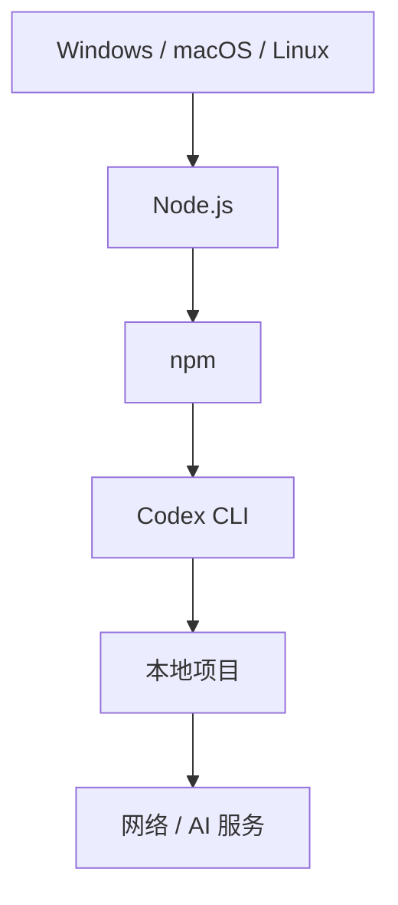

因此：

> **采用 npm 安装 Codex CLI 时，Node.js 是重要的运行环境。**

## 11.2 推荐准备的环境

### 必要 / 视安装方式而定

- 支持的操作系统；
- 网络连接；
- Codex 对应的客户端；
- 账号或对应认证方式。

### CLI npm 路线

- Node.js；
- npm；
- Codex CLI。

### 强烈推荐

- Git；
- VS Code 或其他 IDE；
- 独立项目目录；
- Git 仓库；
- 合理的文件权限。

---

# 十二、Node.js 与 npm

## 12.1 Node.js 是什么

Node.js 是 JavaScript 的运行时环境。

以前 JavaScript 主要运行在浏览器，Node.js 让 JavaScript 也可以运行在：

- 操作系统；
- 终端；
- 服务器；
- 开发工具。

因此大量开发工具使用 Node.js 构建。

## 12.2 npm 是什么

npm（Node Package Manager）可以理解为 **Node.js 生态的软件包管理器**。

例如：

```bash
npm install <package>
```

大致意思是：

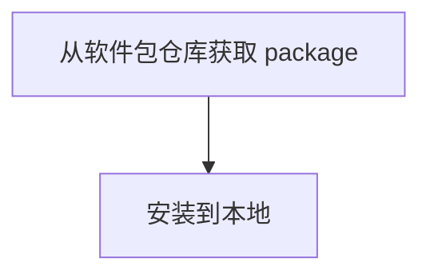

## 12.3 Node.js 与 npm 的关系

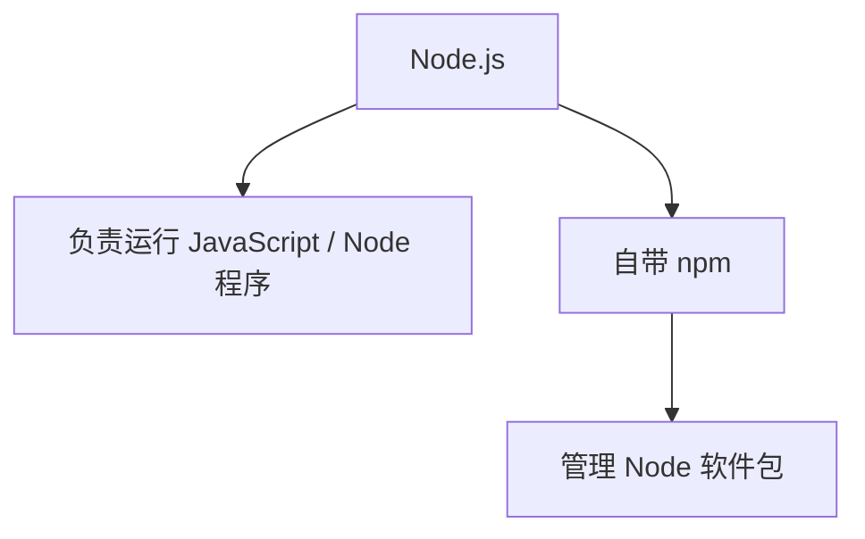

所以：

> Node.js 和 npm 不是两个完全独立的世界。

---

# 十三、Git 与 PATH

## 13.1 Git 为什么推荐安装

Codex 会修改代码。如果项目使用 Git，你可以查看：

```bash
git status
git diff
```

知道 Codex 改了哪些文件、改了什么。如果结果不满意，还可以通过 Git 恢复。

因此：

> Git 是 Codex 工程实践中非常重要的安全网。

## 13.2 PATH 是什么

假设 Node.js 安装在 `C:\Program Files\nodejs\`，如果 PATH 中包含这个目录，那么你可以直接执行：

```bash
node -v
```

而不需要写完整路径。

因此 PATH 可以简单理解为：

> **操作系统寻找可执行程序的目录列表。**

## 13.3 常见 PATH 问题

如果出现 `node 不是内部或外部命令`，优先检查：

1. Node.js 是否安装；
2. PATH 是否正确；
3. 是否重新打开终端；
4. 是否安装到了预期位置。

---

# 十四、Windows 安装 Codex CLI

> 本章节采用“先验证环境，再安装 Codex”的原则。
>
> 具体命令应以当前官方 Codex 文档为准。第三方教程中的固定版本号和旧命令可能随着产品更新而变化。

## 14.1 第一步：安装 Node.js

建议使用 Node.js 官方提供的 LTS 版本。

安装完成后打开 PowerShell：

```powershell
node -v
```

然后：

```powershell
npm -v
```

如果均能显示版本号，说明 Node.js/npm 基本正常。

## 14.2 第二步：安装 Git

安装完成后：

```powershell
git --version
```

如果显示版本号：

```text
git version 2.x.x
```

说明 Git 可用。

## 14.3 第三步：安装 Codex CLI

使用 npm 路线时，可以使用：

```powershell
npm install -g @openai/codex
```

安装完成后：

```powershell
codex --version
```

再执行：

```powershell
codex --help
```

如果可以正常显示版本和帮助信息：

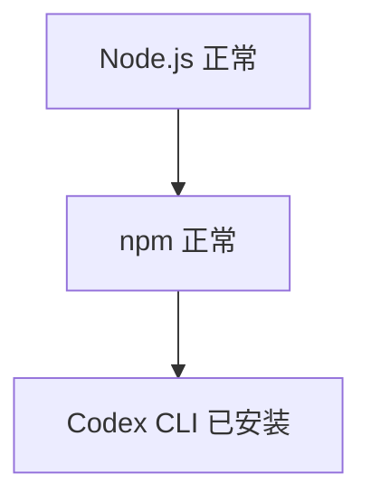

## 14.4 为什么建议先执行 `codex --version`

因为它能把问题拆成两个层次。

### 层次一：安装问题

如果连 `codex --version` 都无法运行，优先检查：

- Node.js；
- npm；
- PATH；
- CLI 安装。

### 层次二：联网 / 认证问题

如果 `codex --version` 正常，但运行任务失败，说明 Codex 本身已经安装成功，应该继续检查：

- 登录；
- API Key；
- Endpoint；
- 网络；
- 模型；
- 权限。

---

# 十五、macOS 与 Linux

## 15.1 macOS

可以使用 Node.js 官方安装包，也可以使用 Homebrew 等包管理工具。

验证：

```bash
node -v
npm -v
```

然后根据当前 Codex 官方安装方式安装 CLI。如果使用 npm：

```bash
npm install -g @openai/codex
```

验证：

```bash
codex --version
```

## 15.2 Linux

Linux 可以使用：

- 系统包管理器；
- Node.js 官方安装方式；
- nvm；
- npm。

如果使用 nvm，优势是：可以比较方便地管理多个 Node.js 版本。

验证：

```bash
node -v
npm -v
```

然后：

```bash
npm install -g @openai/codex
```

最后：

```bash
codex --version
```

---

# 十六、Codex Desktop 与 CLI

## 16.1 Desktop

适合：

- 不熟悉命令行；
- 喜欢图形界面；
- 希望通过项目界面使用 Agent。

典型流程：

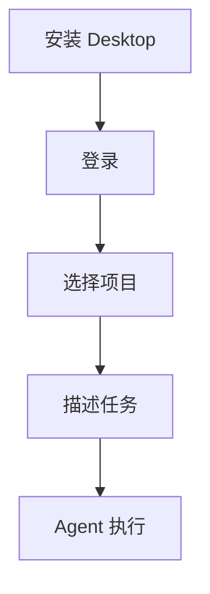

## 16.2 CLI

CLI 是 Command Line Interface 的缩写。

典型流程：

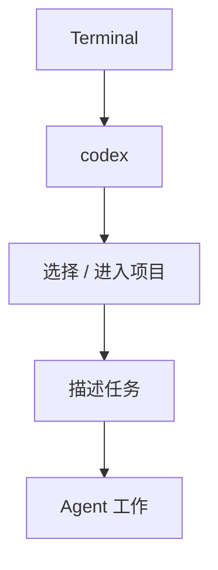

CLI 更适合：

- 程序员；
- Git 工作流；
- 自动化；
- 终端开发；
- 远程开发环境。

---

# 十七、Codex 登录、API Key 与认证

这里必须区分“ChatGPT 账号认证”与“API Key 认证”——它们并不是完全相同的概念。

## 17.1 账号登录

某些 Codex 使用方式可以通过 OpenAI 账号登录：

```mermaid
flowchart TD
    A["Codex"] --> B["登录 OpenAI 账号"]
    B --> C["使用对应服务"]
```

具体可用认证方式取决于当前 Codex 版本和产品形态。

## 17.2 API Key

API 工作流通常使用 API Key：

```mermaid
flowchart TD
    A["程序"] --> B["API Key"]
    B --> C["API Endpoint"]
    C --> D["模型"]
```

## 17.3 不要把 ChatGPT 订阅和 API 额度混为一谈

一个常见误解：“我有 ChatGPT 订阅，所以 API 就自动免费。”

不能这样简单理解。应该区分：

- ChatGPT 产品；
- API 平台。

两套产品和计费体系是独立的。

---

# 十八、Codex 与 API 中转

## 18.1 最基础的 API 结构

```mermaid
flowchart TD
    A["Codex / 程序"] --> B["API Endpoint"]
    B --> C["模型"]
```

## 18.2 中转结构

```mermaid
flowchart TD
    A["Codex / 程序"] --> B["第三方中转 Endpoint"]
    B --> C["上游 AI API"]
    C --> D["模型"]
```

## 18.3 “OpenAI 兼容”是什么意思

很多第三方服务会宣传 “OpenAI API Compatible”，通常意味着它提供与 OpenAI API 某些接口格式相近的访问方式。

但：

> **OpenAI 兼容 API ≠ 一定兼容 Codex 的全部能力。**

原因是 Codex 是 Agent 工作流，不只是“发送 prompt → 得到文本”。Agent 可能涉及：

- Responses API；
- 工具调用；
- streaming；
- 模型特定能力；
- 上下文；
- 文件访问；
- 命令执行；
- Agent 权限；
- 其他服务端能力。

因此选择中转服务时，不要只问“是不是 OpenAI 兼容”，还应该问：

> “是否兼容 Codex 当前版本实际使用的 API 和能力？”

---

# 十九、VS Code 与 Codex

VS Code 是代码编辑器 / 开发环境，Codex 是 AI coding agent，两者可以组合：

```mermaid
flowchart TD
    A["VS Code"] --> B["编辑代码"]
    A --> C["Terminal"]
    A --> D["Git"]
    A --> E["Codex"]
    E --> F["AI"]
```

推荐的工作方式：

```mermaid
flowchart TD
    A["VS Code 打开项目"] --> B["Codex 分析任务"]
    B --> C["Codex 修改代码"]
    C --> D["VS Code 查看 diff"]
    D --> E["运行测试"]
    E --> F["Git 提交"]
```

---

# 二十、第一次使用 Codex 的正确流程

不要第一次就执行“把整个项目全部重构”。

## 第一步：只分析

```text
请先分析当前项目结构。

暂时不要修改任何文件。

告诉我：
1. 项目使用什么技术栈；
2. 核心入口在哪里；
3. 主要模块有哪些；
4. 当前任务涉及哪些文件。
```

## 第二步：制定方案

```text
基于刚才的分析，
请提出修改方案。

暂时不要执行修改。
```

## 第三步：限定范围

```text
只允许修改：

src/components/
src/views/

不要修改：
package-lock.json
配置文件
数据库结构
```

## 第四步：执行修改

```text
按照方案实施修改。

完成后说明：
1. 修改了哪些文件；
2. 每个文件做了什么；
3. 是否新增依赖。
```

## 第五步：运行测试

```text
运行项目现有测试。

如果失败：
分析失败原因并修复。

不要为了通过测试而删除测试。
```

## 第六步：查看 Git Diff

执行：

```bash
git status
```

然后：

```bash
git diff
```

确认 Codex 到底修改了什么。

---

# 二十一、Codex 权限与安全

AI Agent 和普通聊天最大的区别之一：

> Agent 可能拥有操作本地项目的能力。

因此必须理解：

- AI 能看到什么？
- AI 能修改什么？
- AI 能执行什么？
- AI 能访问哪些目录？

## 21.1 推荐的权限原则

遵循**最小权限原则**：

```mermaid
flowchart TD
    A["只读"] --> B["先分析"]
    B --> C["工作区写入"]
    C --> D["允许修改项目"]
    D --> E["更高权限"]
    E --> F["谨慎使用"]
```

## 21.2 不要随便允许危险命令

尤其是涉及：

- 删除文件；
- 修改系统配置；
- 安装未知软件；
- 读取敏感目录；
- 执行未知脚本；
- 上传敏感数据。

的操作。

---

# 二十二、API Key 安全

## 22.1 不要提交到 Git

错误：

```javascript
const apiKey = "sk-xxxxxxxx";
```

然后：

```bash
git add .
git commit
git push
```

这样可能导致 API Key 进入远程仓库。

## 22.2 使用环境变量

例如 `OPENAI_API_KEY`，让程序从环境变量读取。

## 22.3 使用本地配置

如果工具要求本地配置文件（如 `~/.codex/` 或其他本地配置目录），应确保：

- 不上传 Git；
- 权限合理；
- 不发送给他人。

## 22.4 如果 API Key 泄露

不要只删除代码，应该：

1. 立即撤销旧 Key；
2. 创建新 Key；
3. 检查使用记录；
4. 检查账单；
5. 更新本地环境变量；
6. 检查 Git 历史。

---

# 二十三、常见错误与排查

## 23.1 `node` 不是命令

表现：

```text
node is not recognized...
```

检查：

```bash
node -v
```

可能原因：

- Node.js 没安装；
- PATH 没配置；
- 终端没有重新打开。

## 23.2 `npm` 不是命令

检查：

```bash
npm -v
```

如果失败：

- 检查 Node.js；
- 检查 PATH；
- 重新打开终端。

## 23.3 `codex` 不是命令

先检查：

```bash
node -v
npm -v
```

再检查：

```bash
npm list -g --depth=0
```

然后重新安装 CLI。

## 23.4 `codex --version` 正常，但无法连接

这时**不要重新安装 Codex**，因为安装已经基本成功。应该检查：

```mermaid
flowchart TD
    A["Codex"] --> B["认证"]
    B --> C["网络"]
    C --> D["Endpoint"]
    D --> E["模型"]
```

## 23.5 API 请求超时

可能原因：

- 本地网络；
- DNS；
- Endpoint 不可达；
- 中转服务故障；
- 上游服务故障。

应该先判断“电脑 → Endpoint”是否能够建立连接：

```mermaid
flowchart LR
    A["电脑"] --> B["Endpoint"]
```

## 23.6 API Key 无效

检查：

- 是否复制完整；
- 是否已经撤销；
- 是否使用了错误账户；
- 是否配置到错误环境；
- Endpoint 是否对应这个 Key；
- 中转站 Key 是否被误当成官方 Key。

## 23.7 模型不存在

例如 `model not found`，可能是：

- 模型名称错误；
- 服务商没有提供该模型；
- 模型已下线；
- Endpoint 与模型不匹配；
- 中转站没有做正确映射。

不要只修改模型名称，应该先确认当前 Endpoint 支持哪些模型。

## 23.8 “OpenAI 兼容”但 Codex 仍然不能用

这是非常典型的问题。原因可能是普通 Chat Completions 可以使用，但 Codex 所需能力没有完整支持。

因此：

> API 兼容性必须按照具体接口和能力判断，而不是看宣传语。

---

# 二十四、推荐的学习路线

完全小白建议按照以下顺序。

## 第一阶段：网络基础

学习：域名 → DNS → IP → HTTPS → 网络环境差异。

## 第二阶段：AI 基础

学习：模型 → ChatGPT → API → API Key → Endpoint。

## 第三阶段：API 网络

理解两条访问路径：

- 电脑 → 官方 API；
- 电脑 → 中转 → 官方 API。

重点理解：

> **中转是否需要额外的本地网络配置，取决于“电脑 → 中转”这一段是否可达。**

## 第四阶段：开发环境

学习：Node.js → npm → Git → PATH。

## 第五阶段：AI 编程

学习：VS Code → Codex → Agent → Git → 测试。

---

# 二十五、一张图理解完整体系

```mermaid
flowchart TD
    LLM["大模型"] --> API["AI API 服务"]
    API --> OFF["官方 API"]
    API --> MID["中转 API"]
    OFF --> NET["网络连接"]
    MID --> NET
    NET --> PC["你的电脑"]
    PC --> CODEX["Codex"]
    PC --> VSC["VS Code"]
    PC --> GIT["Git"]
    CODEX --> CD["CLI / Desktop"]
    CD --> NODE["Node.js"]
    NODE --> NPM["npm"]
    NPM --> PROJ["本地项目"]
```

---

# 二十六、常见误区

## 误区 1：开了代理，所有软件都自动走代理

不一定。不同软件可能使用系统代理、环境变量、自己的代理设置，或完全不使用代理。

## 误区 2：有中转就一定不用额外配置

错误。正确理解是看“电脑 → 中转”是否可达。

## 误区 3：中转就是 VPN

不是。VPN 解决的是网络连接路径，API 中转解决的是 API 请求转发，它们属于不同层次。

## 误区 4：API Key 就是 ChatGPT 密码

不是。API Key 是 API 访问凭证。

## 误区 5：ChatGPT 订阅 = API 余额

不能直接画等号。ChatGPT 产品和 API 平台存在不同的账户、权限和计费机制。

## 误区 6：安装 Codex 就把 GPT 安装到了电脑

不是。Codex 客户端和云端模型是两个概念。

## 误区 7：Node.js 是大模型

不是。Node.js 是软件运行环境，GPT / Codex 模型才是模型。

## 误区 8：Git 是 Codex 必须依赖

不完全是。Git 更多是强烈推荐的工程开发和安全工具。

## 误区 9：OpenAI 兼容 API 一定兼容 Codex

不一定。需要检查 API 类型、Responses API、工具调用、streaming、模型能力、Agent 所需能力、Endpoint 行为等。

---

# 二十七、最终总结

如果只记住十句话：

1. **能访问互联网，不代表能访问互联网上的所有服务。**
2. **请遵守所在国家/地区的法律法规，不使用未经批准的翻墙工具或服务。**
3. **DNS、IP、HTTPS 是理解网络问题的基础概念。**
4. **API 是程序调用 AI 模型的接口。**
5. **API Key 是 API 访问凭证，必须保护。**
6. **API 中转是在你的程序和上游模型服务之间增加第三方转发层。**
7. **中转站是否需要额外的本地网络配置，要看“你的电脑 → 中转站”是否可以直接访问。**
8. **Codex 是 AI coding agent，不等于把大模型下载到了本地。**
9. **使用 Codex CLI 时，Node.js、npm、PATH、Git、网络和认证属于不同的问题层次。**
10. **排查问题要分清：网络问题、API 问题、工具问题。**

最终可以记成：

```mermaid
flowchart TD
    A["网络问题：我能不能连接到服务？"] --> B["API 问题：我的程序能不能调用模型？"]
    B --> C["工具问题：AI 能不能理解、修改、测试我的项目？"]
```

这三个问题分清以后，绝大多数 AI 工具安装和故障排查都会容易很多。

---

# 参考资料

## OpenAI 官方资料

- [OpenAI Developers](https://developers.openai.com/)
- [OpenAI API 模型文档](https://developers.openai.com/api/docs/models/)
- [GPT-5.3-Codex 模型文档](https://developers.openai.com/api/docs/models/gpt-5.3-codex)
- [Codex 使用场景](https://developers.openai.com/codex/use-cases)

> OpenAI 当前文档显示，GPT-5.3-Codex 是面向 agentic coding 的模型，并支持 Responses API 等能力。具体模型、认证方式和 Codex 功能会持续更新，因此实际安装时应优先查看当前官方文档。

> **提示**：第三方博客或教程中的安装步骤可能随版本变化，也可能包含不符合当地法律法规的内容，请以官方文档为准，并在合规前提下使用。

---

# 附录：一页速查表

| 名词 | 一句话理解 |
| --- | --- |
| DNS | 把域名解析成 IP |
| IP | 网络设备/服务器的地址 |
| HTTPS | 加密的 HTTP 通信 |
| 代理 | 让请求经过代理服务器转发 |
| VPN | 建立虚拟网络通道 |
| API | 程序访问 AI 的接口 |
| API Key | API 访问凭证 |
| Endpoint | API 服务的访问地址 |
| 中转站 | 第三方 API 转发/网关服务 |
| Node.js | JavaScript 运行环境 |
| npm | Node.js 软件包管理器 |
| PATH | 操作系统查找可执行程序的路径列表 |
| Git | 代码版本控制系统 |
| VS Code | 代码编辑器/开发环境 |
| Codex | AI coding agent |
| Agent | 能够围绕目标自主执行多步骤任务的 AI 系统 |

---

# 附录：最简单的最终理解

如果把整个系统比作“寄快递”：

```mermaid
flowchart TD
    A["你"] --> B["需要访问 AI"]
    B --> C["网络"]
    C --> D["API 地址"]
    D --> E["官方 API"]
    D --> F["第三方中转 API"]
    E --> G["AI 模型"]
    F --> G
    G --> H["返回结果"]
    H --> I["Codex"]
    I --> J["阅读项目"]
    I --> K["修改文件"]
    I --> L["执行命令"]
    I --> M["运行测试"]
    I --> N["汇报结果"]
```

而 Node.js 是 Codex CLI 这类 Node 工具运行所需要的运行环境之一；npm 是安装和管理 Node 软件包的工具；Git 则是保护和管理代码变更的重要工程工具。

因此，一套完整的 AI 编程环境不是“安装一个 Codex”这么简单，而是：

```text
网络环境
  +
AI 服务
  +
认证
  +
Node.js / CLI 环境
  +
Git
  +
IDE
  +
Agent 权限
  +
正确的工程工作流
```

理解这套关系之后，再学习具体工具、命令和配置，就不会再把“网络问题、API 问题、安装问题、模型问题”混在一起。
